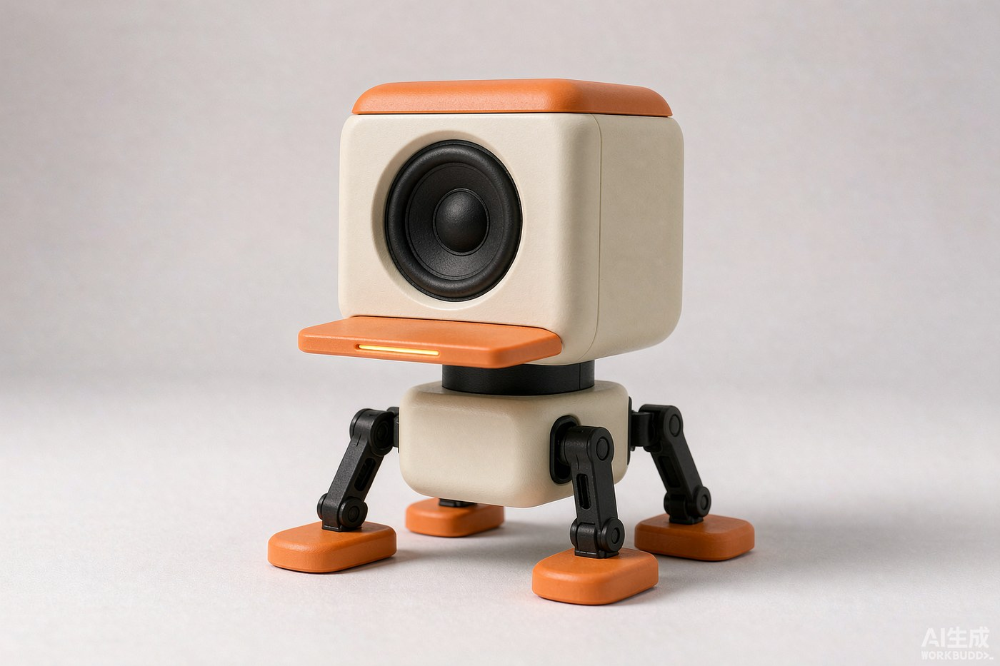
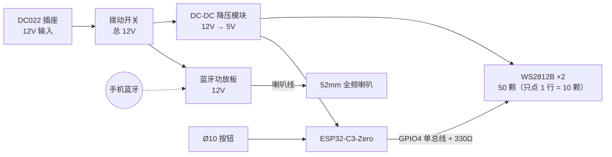

<div align="center">

# Learned Duck

**一台「被训练出来」的桌面蓝牙音箱**
*a desktop speaker that is **learned, not designed***

一条会发光的顶盖 · 一只黑色的眼 · 四条站得住的腿


</div>

<p align="center">
  
</p>

<p align="center"><sub>外观定稿 · 单喇叭版 · 暖奶油壳 ＋ 橙色顶盖与喙 ＋ 黑色四足</sub></p>

---

## 这是什么

Learned Duck 是一台可以放在桌面上的蓝牙音箱。它同时也是一个**完整的、可复现的 3D 打印产品设计项目**——从零件测绘、内部堆叠、外观建模，到打印参数、装配顺序、电路与固件，全部公开。

它的形态是一只抽象的小机器鸭：正面一只裸露的 52mm 全频喇叭充当唯一的「眼」，头顶一块橙色顶盖做成的浅托盘里，一条光带随音乐起伏（那是一条训练曲线，不是一张笑脸），四条带可见转轴关节的黑色机械腿把它从桌面上抬起来。

**它不是一个套壳的现成方案。** 所有零件都是从零开始测绘、从零开始排布、从零开始建模的。

---

## 为什么叫 Learned Duck

这个项目的形象取自 [**MicroDuck**](https://github.com/pollen-robotics/microduck)——Hugging Face 与 Pollen Robotics 合作的一只 25cm 四足机器鸭。

它最有意思的地方不在于外形，而在于：**它的动作不是被设计出来的，是被训练出来的。** 7 个步态策略全部由 MuJoCo 物理仿真 + PPO 强化学习习得，软件栈以 Apache-2.0 开源。

> *"It doesn't follow a script — every duck learns its own gait."*

这个项目把同一句话翻译成了产品语言：

> **形态是设计的，行为是被训练出来的。**
> *The shell is designed. The behavior is learned.*

所以它叫 Learned Duck —— 一只「学出来的」鸭。

### 致敬落点

| # | 落点 | 在实物上的体现 |
|---|---|---|
| 1 | **单眼即镜头** | MicroDuck 是一颗大圆镜头承担全部表情。本项目转译为**一只居中裸露的 52mm 喇叭**，黑色振膜就是眼珠，不做网罩遮蔽 |
| 2 | **喙的语言** | 一片扁平的哑光色件，根部与壳面齐平、向外渐增 2mm。它由「形」与「色」致敬，不靠加特效 |
| 3 | **彩色顶盖** | 头顶一块橙色顶盖，带一条干净的分型线与壳体分开——直接取自它的头部做法 |
| 4 | **一主一强一中** | 大面积中性壳体 + 小面积高饱和强调色 + 黑色结构件，比例约 6 : 3 : 1 |
| 5 | **四组配色** | 奶油 / 石墨 / 薰衣草 / 天蓝，色号照抄，不自行发明 |
| 6 | **骨架不遮不掩** | 颈、腿、髋支架、振膜全部外露，分型线不做无缝打磨 |
| 7 | **行为感** | 最见功夫的一处：**开机的第一段光纹由随机种子生成，每台机器都不一样** |

第 7 条来自它的一句设定——*每只鸭子第一次醒来都会获得自己的声音*。这里换成了光：**每一台 Learned Duck 第一次通电，都会生成一段只属于它的启动光纹，此后每次开机都重放同一段。**

### 出处标记

底壳激光刻有一行字：

```
trained, not designed
```

旁边留有一个 24 × 24 的平面区，用于激光补刻本仓库的二维码。

---

## 硬件清单 (BOM)

<details open>
<summary><b>点击展开 / 收起</b></summary>

| 类别 | 零件 | 规格 | 数量 |
|---|---|---|---|
| 主控 | ESP32-C3-Zero | 微雪 ESP32-C3FH4 | 1 |
| 音频 | 蓝牙功放板 | 立体声，12V 输入（自带蓝牙接收） | 1 |
| 音频 | 全频喇叭 | 2 寸，Ø52 方框法兰，4Ω 10W | 1 |
| 灯光 | WS2812B 灯板 | 5 × 5 = 25 颗，5050 封装 | 2（拼成 10 × 5） |
| 电源 | DC-DC 降压模块 | 迷你，固定 5V（峰值 3A / 持续 1.6A） | 1 |
| 电源 | DC022 电源插座 | DC5.5-2.1，带螺纹，开孔 Ø12 | 1 |
| 电源 | 12V 适配器 | **≥ 3A（建议 4A）** | 1 |
| 操作 | 拨动开关 | SS12F15V，2 档 3 脚 | 1 |
| 操作 | 金属按钮 | Ø10 自锁式 | 1 |
| 结构 | 热熔铜螺母 | M3×5×4.5 / M2×3×3 | 若干 |
| 结构 | 沉头螺丝 | M3×10（合壳、髋、腿）／ M2×10（前脸与外罩） | 若干 |
| 结构 | 丝杆 | M4 × 长（颈内脊柱） | 2 |
| 结构 | 冷轧钢板 | 60 × 40 × 3，约 56 g（配重＋功放散热） | 1 + 螺丝配重 |
| 辅料 | 闭孔泡棉胶条 | 宽 8，厚 2（喇叭法兰气封） | 1 卷 |
| 辅料 | 3M VHB 双面胶 | 4910 一类（粘灯板、粘橙灯框） | 若干 |
| 辅料 | 硅胶防滑脚垫 | Ø10 自粘 | 4 |
| 辅料 | 中性硅胶密封胶 | 封过线孔（声学腔唯一开口） | 1 支 |
| 辅料 | DIN 串联电阻 | 330 Ω（焊在灯板焊盘外 5–10 mm） | 1 |
| 辅料 | 导线 | 20AWG 硅胶线红/黑 各 1 m（12V 主线）；24AWG 镀锡跳线（其余） | 若干 |

</details>

> **注意**：原采购清单中没有 12V 电源适配器，需要单独准备。功放 12V 侧峰值约 2.0A、降压模块输入约 0.3A，合计接近 2.3A，**2A 的会掉压重启**，请备 **≥3A**。

> **螺丝长度是先算出来的，不是凑出来的。** 每个紧固点都要满足
> `杆长 ≥ 沉台深 + 各层壁厚 + 咬合（≥4 牙）`，
> 上限则是 `沉台 + 壁厚 + 螺母长 + 0.5~1.0` 间隙——杆尖顶死会撑裂塑料。
> 详见 [`docs/15_紧固件知识手册.md`](docs/15_紧固件知识手册.md)。

---

## 尺寸与结构

外壳为**四段式**结构：头 / 颈 / 身 / 四足。头身分离既是为了造型比例，也让喇叭腔和电路腔彻底解耦——这是声学与装配同时受益的一处设计。

<!-- ═══════════════════════════════════════════════════════════════
     图位 2 · 三视图（正 / 侧 / 俯）
     建议文件：docs/images/02-three-views.png
     ═══════════════════════════════════════════════════════════════ -->

> *[ 图位待放：正视图 / 侧视图 / 俯视图 ]*

| 段 | 尺寸 (mm) | 说明 |
|---|---|---|
| 头 | 96 W × 102 H × 62 D | 单只 52mm 喇叭居中外露（黑色振膜即眼珠）；橙顶盖做成灯托盘；前脸下部为橙色外框 + 一条浅入光窗 |
| 颈 | 高 26 | 外露黑色结构柱，内部穿 2 × M4 螺纹杆作金属脊柱；灯线、喇叭线由此下行 |
| 身 | 76 W × 52 H × 64 D | 电路腔：功放板 / ESP32-C3 / 降压模块 / DC 座 / 拨动开关 / 按钮；底部预留配重槽 |
| 四足 | 腿高 36，截面 20 | 髋支架从机身两侧兜住；两段式带定位齿盘关节；脚掌 40 × 32 |
| **总计** | **总高 ≈ 216** | 脚距 左右 128 / 前后 112 |

> **重要**：以上为**设计基准值**，正随零件实测数据迭代。已完成实测替换的版本记录在 [`docs/`](docs/) 中。

### 三个关键声学与结构决策

1. **声学后腔直接挖进前壳。** 不做独立内胆——前壳抽壳成碗，碗内净空就是后腔，后壳盖上的接缝内侧封一圈泡棉/热熔胶。头壳只有唯一一个开口（Ø10 过线孔，打胶密封），所以**唯一的密封风险面只有接缝一圈**，比拼装内胆少一整层误差。
2. **光在头顶，不在脸上。** 2 块灯板拼成 80 × 40，摆进橙色顶盖做成的浅托盘（外廓 92 × 52，墙高 10）。顶盖自带腔体，不需要另开光箱；**固件只点中间那一行 10 颗**，50 颗全亮点阵会读成散热片，一行光才是"设计语言"。灯与喇叭各走一侧线束，DIN 不与模拟音频并排。
3. **颈是悬臂梁，不是装饰柱。** 头上部约 255 g 全部压在颈上，而 FDM 打印件的层间剪切强度远低于层内。颈内穿两根 M4 螺纹杆承力，打印件只做外壳，且**必须横躺打印**。颈内径需 ≥ 20 mm，否则 2 根 M4 加 5 芯线束（喇叭 2 + 灯 3）挤不开。

---

## 电子架构



| 部分 | 说明 |
|---|---|
| 音频链路 | 手机 → 蓝牙 → **功放板自己收**（ESP32 不参与音频）。功放独立取 12V，不经降压模块 |
| 为什么要这样 | ESP32-C3 在 Arduino 下跑 A2DP 会有缓冲抖动爆音，且会让手机同时看到两个蓝牙设备。本项目 ESP32 只管灯与按键 |
| 灯光链路 | 降压模块 5V 单独给灯板一路（不与 ESP32 共用细线，防数字噪声串进音频）；ESP32 用 **GPIO4** 出单总线 |
| 交互 | Ø10 按钮循环切换灯光模式；**拨动开关串在总 12V 最前端**，切断全机（不是只关灯） |
| 天线净空 | ESP32 天线端 10mm 范围内不得有金属、不得紧贴壳壁 |

### ⚠️ 电流限制（必读）

**降压模块的持续输出只有 1.6A**（铭牌峰值 3A 不代表能长期扛）。当前灯光只点亮中间一行：

| 亮度 | 10 颗电流 | 降压总负载 | 余量 |
|---|---|---|---|
| 120/255 | 0.28 A | 0.38 A | 4.2× |
| **180/255（当前上限）** | 0.42 A | **0.52 A** | **3.1×** |
| 满亮 255 | 0.60 A | 0.70 A | 2.3× |

> 这两条是硬约束，改之前先算：**① 一颗 WS2812B 全亮约 60 mA；② 若哪天让 50 颗全亮点亮，亮度上限必须收回 ≤ 120/255（约 1.2 A）。**
> 灯板电源单独走一路（24AWG 以内细线带不动数字噪声 + 电流），不与 ESP32 共用。

冷却：20W 功放封在约 0.2 L 的塑料腔里是**唯一可靠的散热路径**——钢板兼配重与散热片，功放贴钢板、钢板贴壳壁。

---

## 3D 打印与后处理

| 项目 | 参数 |
|---|---|
| 材料 | **PETG**（韧性优于 PLA，耐温约 70℃） |
| 层高 | 外壁 0.16–0.18 mm，内部 0.24 mm |
| 壁 / 填充 | 壁 3 圈；顶底 6 层；填充 20–25%（**腿、颈、髋支架 45%**） |
| 打印方向 | **腿必须侧卧**、**颈必须横躺**——让层纹垂直于受力方向 |
| 外观面 | 朝上、避开支撑；头壳建议后壳朝下、正面朝上 |
| 配合公差 | 配合面留 0.3 mm |
| 热熔螺母柱 | 柱外径 M3 ≥ Ø7.0 / M2 ≥ Ø5.5，柱高 ≥ 螺母长 + 1，柱身加 3–4 条纵向加强肋 |

**后处理（这一步比任何造型改动都更影响成品档次）**

1. 趁热压入热熔铜螺母（250–260℃）
2. 打磨 400 → 800 → 1500 目
3. 补土填平层纹明显的区域
4. 底漆 → 晾 12h↑ → 哑光面漆 → 晾 24h↑

---

## 装配顺序

完整步骤见 [`docs/17_电路系统设计与接线.md`](docs/17_电路系统设计与接线.md)。核心顺序由三条规则锁定：

> **① 能单独做完并测过的，绝不合起来做。**
> **② 整机在装配过程中必须始终能平躺。**
> **③ 前壳与后壳一合上，手就伸不进头里了** —— 所有线必须在合后盖之前插好放到位。

```
01  台面测试一：功放 + 12V 电源 + 两只喇叭接起来，通电出声（音频最难，先闭环）
02  台面测试二：ESP32 + 降压 + 两块灯板，先单颗亮、再两块串联
03  身部装配：钢板 + 导热垫 + 功放板组件 → DC 座 / 开关 / 按钮 → 合身上盖
04  穿颈线：喇叭线与灯线分两侧穿过颈（颈内径 ≥ 20 mm），接上身
05  头顶：灯板摆进顶盖托盘（同心配合定位）→ 从盘底往上拧 M3×10
06  头内：腔内装电路 → 前脸装喇叭（4 颗 M2×10 从正面拧）→ 压泡棉环 → 扣橙外罩
07  腔内拧：4 颗 M2×10 从后口伸进去锁外罩 → 过线孔打胶封（唯一开口，不能漏气）
08  合后盖 → 四腿调平、贴防滑垫、烧录固件、收线
```

**四个最容易翻车的地方**（都用规则化解在顺序里了）：合壳时夹住线 → 声学腔漏气；竖着打的腿 → 沿层断裂；先装腿后装电路 → 螺丝刀伸不进去；灯泡没在台面测过就进壳 → 要拆整个后盖。

---

## 灯光系统

### 当前实现（v0.1）

三种灯光模式，由按钮循环切换：**待机呼吸** / **音乐律动** / **流光扫描**。

### 预留的可选基础

这些接口已经**在设计上留好位置，但当前版本不实现**——目的是让日后扩展只需新增，不必返工：

| 预留项 | 现在怎么做 | 日后怎么加 |
|---|---|---|
| **模式表架构** | 固件中已建立 `{名称, 函数指针}` 模式表，表里只填 3 项 | 加模式＝写一个函数 + 表里加一行 |
| **个体化启动光纹** | NVS 中已预留 `seed` 字段，当前写死固定值 | 把那一行改成随机数生成，启动光纹即变成每台唯一 |
| **腿部姿态** | 关节已做成 12 档定位齿盘（30°/档），**可手动摆放** | 刻姿态对齐线 + 调预压，即可摆出「站 / 坐 / 趴」 |
| **舵机驱动** | 轴孔 Ø3.2 已按此基准设计 | 改用舵机时，轴孔即安装基准 |
| **二维码** | 底壳内侧预留 24 × 24 平面区 | 激光补刻，无需重新建模 |

---

## 开发里程碑与提交节奏

这个仓库**不设定时推送**——每完成一个里程碑就提交、推送一次，不留尾巴。
里程碑边界（也是提交边界）：

| 里程碑 | 范围 | 状态 |
|---|---|---|
| M1 · 测绘与基准 | 零件测绘表、尺寸基准表、采购补件清单 | ✅ |
| M2 · 造型定稿 | 单喇叭居中＋橙顶盖＋短喙＋四足；概念图与三视图 | ✅ |
| M3 · 结构与堆叠 | 五腔分述、机构详图、13 件打印清单 | ✅ |
| M4 · 外观建模 | 前壳 P1／后壳 P2／外罩 P14／顶盖 P3／紧固件标准件 | ✅ |
| M5 · 灯光与电路定稿 | 顶盖灯箱、灯板安装、螺丝配对体系、电路系统与接线 | ✅ 本提交 |
| M6 · 打印件出图 | 全套打印参数、切片、后处理与公差复核 | 待开始 |
| M7 · 装配与调试 | 打印后处理、电路焊接、总装、调平、成品记录 | 待开始 |
| M8 · 出图与归档 | 三视图／剖视图／爆炸图／件号表 | 待开始 |
| M9 · **v1.0** | 强化学习步态（舵机版，MuJoCo + 仿真训练） | 路线上 |

提交信息格式：`前缀: 一句话`（`cad:` 零件模型 ／ `docs:` 文档 ／ `chore:` 杂项），
按主题拆成小提交，不把无关改动揉在一起。

---

## 路线图

- [x] 零件测绘与尺寸基准
- [x] 造型方案定稿（单喇叭居中 + 橙顶盖 + 短喙 + 四足）
- [x] 内部堆叠与机构详图
- [ ] 按实测值更新全部尺寸基准
- [ ] SolidWorks 建模（外壳 12 件）
- [ ] 打印试件验证（喇叭沉台 / 合壳搭接唇 / 齿盘）
- [ ] 全套打印与后处理
- [ ] 电路焊接与调试
- [ ] 总装、调平、成品记录
- [ ] 出图：三视图 / 剖视图 / 爆炸图 / 件号表
- [ ] **v1.0** — 强化学习步态（舵机版，MuJoCo + 仿真训练）

---

## 已知限制

诚实记录，避免误导：

- **单声道。** 单只喇叭居中做「眼」，放弃了立体声声像。第二只喇叭可藏入身内向下发声，但会挤占电路腔容积，当前版本未采用。
- **关节是静态的。** 齿盘可在有限档位内手动摆放，但**不能自主运动**。真实可动需要舵机，属 v1.0 范围。
- **满亮超载。** 见上文电流限制一节。
- **尺寸仍在迭代。** 部分标注为设计基准值，待零件实测数据替换。
- **无倒相孔。** 采用密闭箱设计，低频下潜有限——这是 2 寸单元在小体积下的物理限制，不是设计缺陷。

---

## 仓库结构

```
.
├── README.md                     项目说明（你现在读的这份）
├── LICENSE                       硬件设计 · CC BY-NC-SA 4.0
├── LICENSE-CODE                  固件代码 · MIT
│
├── docs/                         设计文档
│   ├── 01-零部件测绘表.md         测量方法与清单
│   ├── 02-零件尺寸基准表.md       尺寸数据与出处 —— 建模唯一数据源
│   ├── 03-内部结构分析.html       五腔分述 · 受力路径 · 装配顺序
│   ├── 04-喙尺寸图.html          单一零件的完整工程定义
│   ├── 05-内部堆叠与机构详图.html  堆叠 · 机构详图 · 打印件清单
│   ├── 09_采购补件清单.md          缺件与补件（含 12V/3A 适配器）
│   ├── 10_外盖P14定义.md           外罩背面热熔螺母与对接口
│   ├── 11_灯光（LED）方案评估.md    三轴空间账 · 亮度与电流上限
│   ├── 12_灯板安装.md               固定方案 · 330Ω · GPIO4 · 走线
│   ├── 13_橙灯框P15与浅入灯位.md    前脸灯框与浅入量
│   ├── 14_螺丝与热熔螺母配对体系.md 每个紧固点的三层孔与杆长
│   ├── 15_紧固件知识手册.md         选型、头型、防松、SW 操作铁律
│   ├── 16_顶盖灯箱方案（LED上置）.md LED 移到头顶托盘
│   ├── 17_电路系统设计与接线.md     架构 A · 电源树 · 14 条接线 · 建模留位
│   └── images/
│       └── hero.jpg             外观定稿渲染
│
├── cad/                         CAD 模型（尚未上传）
│   └── README.md                导出约定与打印方向
└── firmware/                    固件（尚未提交）
    └── README.md                接口设计说明
```

> **刻意没有放进来的东西。**
> 外观探索的 21 版过程渲染、个人实施计划与作业单、课程材料，以及内部工作记录——它们对「复现这台音箱」没有价值，所以不占仓库体积。
>
> 取舍只有三条：**能复现的进，过程稿不进，别人的材料不进。**


---

## 许可

完整条款见 [`LICENSE`](LICENSE)（硬件）与 [`LICENSE-CODE`](LICENSE-CODE)（固件）。

本项目采取**分开授权**（硬件与代码属性不同）：

| 部分 | 建议许可 |
|---|---|
| 硬件设计（CAD、图纸、文档） | CC BY-NC-SA 4.0 |
| 固件代码 | MIT |

> 选择 NC（非商业）是因为这是一个课程设计作品；若你打算商业使用，请先联系作者。

---

## 致谢

- **[MicroDuck](https://github.com/pollen-robotics/microduck)** — Hugging Face × Pollen Robotics。本项目的形态语言与行为概念全部源于它。若你喜欢这只鸭，请去给原项目一个 star。
- **MuJoCo / PPO** — 让「行为可以被学出来」成为可能的那套工具。
- 华南理工大学设计学院 · 计算机辅助工业设计

---

<div align="center">

*The shell is designed. The behavior is learned.*

**trained, not designed**

</div>
